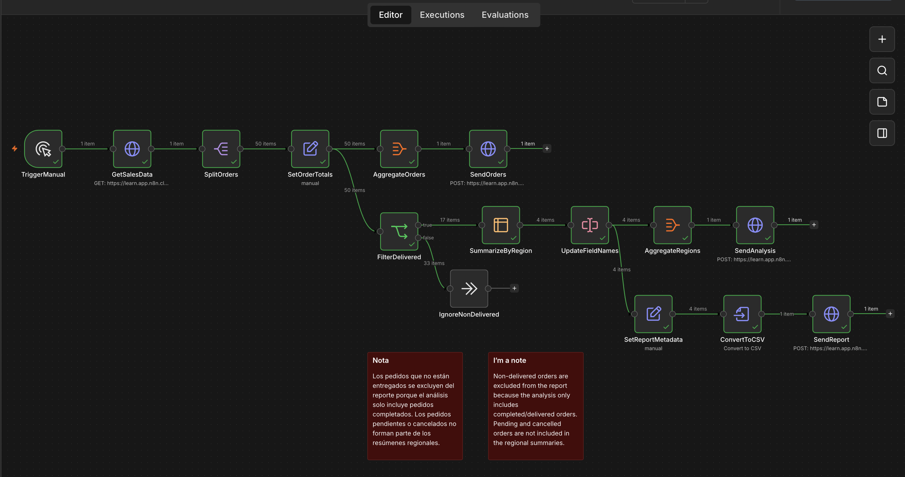

# ⚡ Sales Data Pipeline — n8n Automation Workflow

Desarrollo de un workflow de automatización en **n8n** diseñado para procesar, transformar y analizar datos de ventas de manera automática consumiendo APIs REST.

 

---

## 📌 Descripción del Proyecto
El pipeline obtiene información de pedidos a través de peticiones HTTP, transforma y filtra los datos según su estado, calcula métricas clave por pedido y genera resúmenes agregados por región para alimentar endpoints externos de reportes.

### 🔄 Flujo de Trabajo (Step-by-Step):
1. **Ingesta de Datos:** Consumo de información de ventas mediante peticiones HTTP a una REST API.
2. **Transformación & Filtrado:** Separación de datos, cálculo de totales por pedido y filtrado exclusivo de órdenes completadas.
3. **Agregación por Región:** Procesamiento de pedidos entregados aplicando operaciones de suma, conteo y promedio para métricas regionales.
4. **Envío & Reportes:** Agrupación y formato de payload en JSON para enviar a endpoints finales vía HTTP Request.

---

## 🛠️ Tecnologías y Conceptos
* **Plataforma:** n8n (Workflow Automation)
* **Integración API:** REST API, HTTP Requests, Endpoints
* **Manejo de Datos:** JSON, Data Transformation, Data Aggregation
* **Lógica de Negocio:** Conditional Logic, Branching, Filtering

---

## 🚀 Cómo importar este flujo en tu n8n
1. Descarga el archivo [`sales-data-pipeline.json`](./sales-data-pipeline.json) de este repositorio.
2. En tu instancia de n8n, crea un nuevo flujo.
3. Haz clic en el menú superior derecho y selecciona **Import from File**.
4. Selecciona el archivo `.json` cargado para importar todos los nodos y lógica del flujo.
